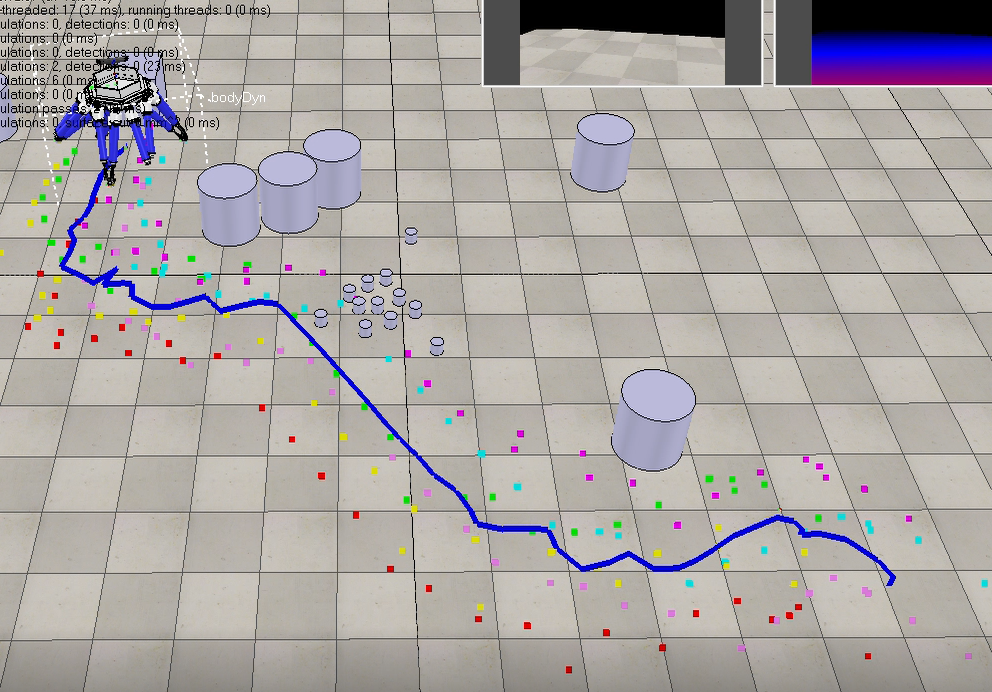

Use sim-to-real reinforcement learning to train a hexpod learn to walk to its target at the same time get rid of the obstacles. 

> low level locomotion control for robot to walk

> high level control for robot to naviate

[Download paper here](http://lonelyfluency.github.io/files/HexpodPaper.pdf)
