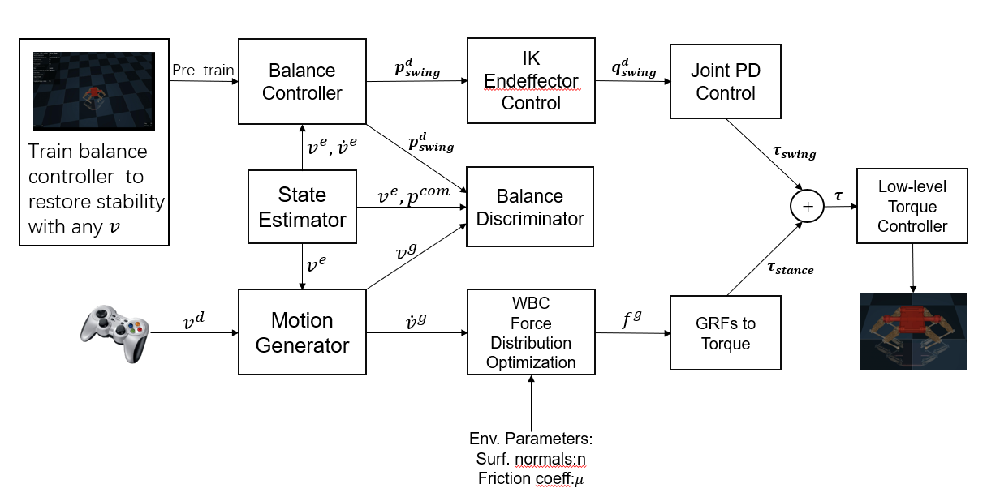

Separate legged robot balance control into two separate agents, stance and swing legs.
Stance legs controlled with WBC method are responsible for generating acceleration to track target velocity. While swing legs controlled with RL method are responsible for balance the robot.

Use adversarial training for stance and swing legs to control the legged robot track the desired velocity fast and stable.

### System Framework

